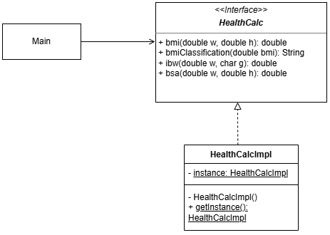
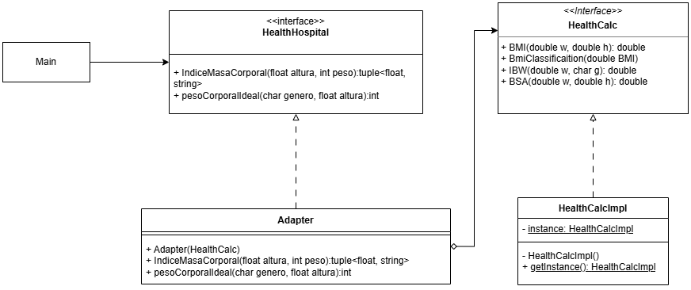
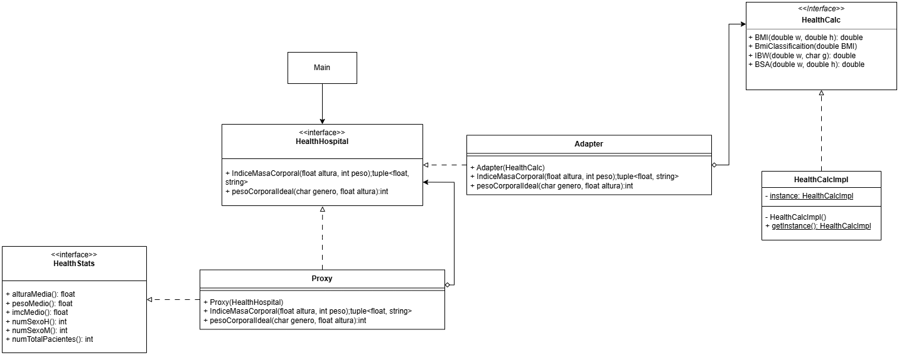
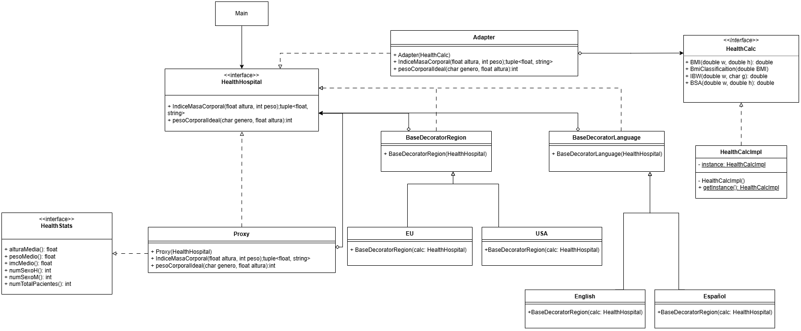

# HealthCalc
Bienvenido al proyecto de la asignatura de **Ingeniería del Software Avanzada**.

El [Hospital Universitario Virgen de la Victoria (El Clínico)](https://www.sspa.juntadeandalucia.es/servicioandaluzdesalud/hospital/virgen-victoria/) de Málaga nos ha encargado el desarrollo de una **Calculadora de Salud** (**_HealthCalc_**) que permita calcular diferentes métricas de los pacientes.

## Requisitos  

<b>Requisitos Funcionales</b>

- La calculadora debe dar soporte a al menos tres métricas.

<b>Requisitos No Funcionales</b>

Para que el proyecto cumpla con estándares de software médico, se deben incluir:
- **Gestión de Errores:** Manejo de excepciones en divisiones por cero (ej. altura 0 en IMC).
  1.  **Validación de Rangos (_Data Scrubbing_):**
      * *Hard Limits:* Bloquear entradas imposibles (ej. altura de 4 metros).
      * *Soft Limits:* Avisos ante valores inusuales pero posibles.
    
        > **Límites Biológicos Reales**:
            * **Altura:** El ser humano más alto registrado midió aproximadamente 272 cm. Un límite de 300 cm es un "Hard Limit" sensato.
            Un recién nacido puede medir 40cm. Un límite inferior sensato es de 30cm.
            * **Peso:** El peso máximo registrado ronda los 635 kg. Un límite de 700 kg sería el tope lógico.
            Un recién nacido puede pesar 2kg. Un límite inferior sensato es de 1kg.
  2.  **Soporte Multi-unidad:** Conversión automática entre sistema métrico (kg, cm) e imperial (lb, ft/in).
  3.  **Gestión de Errores:** Manejo de excepciones en divisiones por cero (ej. altura 0 en IMC).
- Todo el código de la aplicación (incluido los comentarios) deben estar en inglés.
- **Privacidad (_Compliance_):** Si el software almacena datos, debe considerar la anonimización de la Información Personal Identificable (PII) bajo normativas como GDPR o HIPAA.

## Métricas de HealthCalc

<b>Métricas Antropométricas</b>

* **M1: Índice de Masa Corporal (IMC) o _Body Mass Index (BMI)_:** El IMC es es un indicador estándar, adoptado por la [Organización Mundial de la Salud (OMS)](https://www.who.int/es), que evalúa la adecuación del peso de una persona en relación con su altura para estimar la grasa corporal.

    * **Fórmula:** $IMC = \frac{\text{peso (kg)}}{\text{altura (m)}^2}$

    El IMC nos permite clasificar el estado nutricional de una persona en categorías. La OMS ha definido la siguiente clasificación estándar del estado nutricional en adultos:

      - Bajo peso ($<18.5$)
      - Normal ($18.5-24.9$)
      - Sobrepeso ($25-29.9$)
      - Obesidad ($\ge 30$)

---

* **M2: Peso Corporal Ideal (PCI) o _Ideal Body Weight (IBW)_:** El PCI estima el peso teórico que se asocia con el menor riesgo de mortalidad y una mejor salud para un persona.

    Existen diferentes fórmulas para calcular el PCI:

    1. **Fórmula de Devine (1974)**
    Es la más extendida en entornos clínicos para ajustar dosis de medicamentos.

        - **Hombres:** 50 kg + [2.3 × (estatura en pulgadas - 60)]
        - **Mujeres:** 45.5 kg + [2.3 × (estatura en pulgadas - 60)]

    2. **Fórmula de Robinson (1983)**
    Es una variante de Devine más precisa, dando valores más bajos en mujeres y más altos en hombres. 

        - **Hombres:** 52 kg + [1.9 × (estatura en pulgadas - 60)]
        - **Mujeres:** 49 kg + [1.7 × (estatura en pulgadas - 60)]

    3. **Fórmula de Hamwi (1964)**
    Fórmula clásica utilizada por dietistas y nutricionistas debido a su sencillez.

        - **Hombres:** 48.1 kg + [2.7 × (estatura en pulgadas - 60)]
        - **Mujeres:** 45.4 kg + [2.2 × (estatura en pulgadas - 60)]

    4. **Fórmula de Lorentz (1929)**
    Es la fórmula más sencilla de aplicar manualmente ya que utiliza directamente la estatura en centímetros y no requiere conversiones a pulgadas.

        - **Hombres:** $PCI = (Estatura en cm - 100) - \frac{Estatura - 150}{4}$
        - **Mujeres:** $PCI = (Estatura en cm - 100) - \frac{Estatura - 150}{2}$

    **Nota:** Para convertir la estatura de **cm a pulgadas**, hay que dividir los centímetros entre **2.54**.

---

* **M3: Área de Superficie Corporal (ASC) o _Body Surface Area (BSA)_:** El ASC es una medida clínica utilizada para calcular dosis precisas de medicamentos, especialmente en quimioterapia y fluidos intravenosos, y para evaluar la severidad de quemaduras.

    La fórmula más común es la de **Mosteller**:

    * **Fórmula (Mosteller):** $BSA = \sqrt{\frac{\text{altura (cm)} \times \text{peso (kg)}}{3600}}$    

---

* **M4: Perímetro Abdominal (PA) o _Waist Circumference_ (WC):** Es la medición lineal de la circunferencia de la cintura. Se considera el indicador clínico directo de grasa visceral más sencillo y aceptado para predecir obesidad abdominal.
  
    * **Valores de Referencia (Riesgo Elevado):**  
      - **Hombres:** $\ge 94\text{ - }102 \text{ cm}$  
      - **Mujeres:** $\ge 80\text{ - }88 \text{ cm}$

---

* **M5: Índice de Cintura-Cadera (ICC) o _Waist-to-Hip Ratio_ (WHR):** Es ICC la relación entre el perímetro de la cintura y el de la cadera. Se utiliza para identificar la distribución de la grasa (cuerpo tipo "manzana" o "pera") y estimar el riesgo de enfermedades cardiovasculares.
  
    * **Fórmula:** $ICC = \frac{\text{Circunferencia de cintura (cm)}}{\text{Circunferencia de cadera (cm)}}$
    * **Valores de Riesgo (OMS):**  
        - **Hombres:** $> 0.90$  
        - **Mujeres:** $> 0.85$

    Tipos de Morfología:

    1.  **Cuerpo en forma de Manzana (Androide):**
        * **Definición:** La grasa se acumula principalmente en la zona abdominal (tronco).
        * **Implicación Clínica:** Mayor riesgo de hipertensión, diabetes tipo 2 y enfermedades cardíacas debido a la cercanía de la grasa a los órganos vitales (grasa visceral).
        * **Criterio:** Se asigna si el ICC supera los límites de la OMS (>0.90 en hombres, >0.85 en mujeres).

    2.  **Cuerpo en forma de Pera (Ginoide):**
        * **Definición:** La grasa se almacena mayoritariamente en la cadera, glúteos y muslos.
        * **Implicación Clínica:** Generalmente asociada a un menor riesgo metabólico que la forma de manzana, aunque puede relacionarse con problemas articulares o varices.
        * **Criterio:** Se asigna si el ICC está dentro de los rangos normales o bajos.

    | Sexo | Rango ICC | Categoría Morfológica | Riesgo de Salud |
    | :--- | :--- | :--- | :--- |
    | **Hombre** | $\le 0.90$ | Pera (Ginoide) | Bajo / Moderado |
    | **Hombre** | $> 0.90$ | **Manzana (Androide)** | **Alto** |
    | **Mujer** | $\le 0.85$ | Pera (Ginoide) | Bajo / Moderado |
    | **Mujer** | $> 0.85$ | **Manzana (Androide)** | **Alto** |

<b>Métricas Metabólicas y Nutricionales</b>

* **M6: Tasa Metabólica Basal (TMB) o _Basal Metabolic Rate (BMR)_:** El TMB calcula la cantidad mínima de energía (calorías) que el cuerpo necesita en reposo absoluto. 

    Existen diferentes fórmulas para calcular el PCI:

    1. **Ecuación de Mifflin-St Jeor**
    Es actualmente la más precisa para la población general y la que utilizan la mayoría de calculadoras modernas. 

        - **Hombres:**  `TMB = (10 × peso en kg) + (6.25 × altura en cm) - (5 × edad en años) + 5`
        - **Mujeres:**  `TMB = (10 × peso en kg) + (6.25 × altura en cm) - (5 × edad en años) - 161`

    2. **Ecuación de Harris-Benedict (revisada)**
    Es el método clásico. La versión original de 1919 fue revisada en 1984 por Roza y Shizgal para mejorar su exactitud.

        - **Hombres:**  `TMB = 88.362 + (13.397 × peso en kg) + (4.799 × altura en cm) - (5.677 × edad en años)`
        - **Mujeres:**  `TMB = 447.593 + (9.247 × peso en kg) + (3.098 × altura en cm) - (4.330 × edad en años)`

    3. **Ecuación de Katch-McArdle**
    A diferencia de las anteriores, esta fórmula no distingue entre sexos, sino que utiliza la Masa Corporal Magra (peso sin grasa). Es ideal si conoces tu porcentaje de grasa corporal.
        - `TMB = 370 + (21.6 × Masa Corporal Magra en kg)`
            > **Nota:** Masa Magra = Peso total × (1 - % de grasa decimal)

    4. **Ecuación de la OMS (FAO/WHO/UNU)**
    Utilizada a menudo en estudios de salud pública, divide el cálculo por rangos de edad específicos: 

        | Edad (Años) | Hombres | Mujeres |
        | :--- | :--- | :--- |
        | **18 – 30** | `(15.057 × peso) + 692.2` | `(14.818 × peso) + 486.6` |
        | **30 – 60** | `(11.472 × peso) + 873.1` | `(8.126 × peso) + 845.6` |
        | **> 60** | `(11.711 × peso) + 587.7` | `(9.082 × peso) + 658.5` |

---

* **M7: Gasto Energético Diario Total (GEDT) o _Total Daily Energy Expenditure (TDEE)_:** El TDEE es la cantidad total de calorías que el cuerpo quema en 24 horas. Suma el metabolismo basal (funciones vitales en reposo), la actividad física, la digestión y el movimiento cotidiano. Es esencial para ajustar la nutrición (perder, ganar o mantener peso).

    Para obtener las calorías totales que quemas al día, multiplica tu **TMB** por tu nivel de actividad:

    - **Sedentario** (poco/nada de ejercicio): `TMB × 1.2`
    - **Ligero** (ejercicio 1-3 días/semanas): `TMB × 1.375`
    - **Moderado** (ejercicio 3-5 días/semana): `TMB × 1.55`
    - **Fuerte** (ejercicio 6-7 días/semana): `TMB × 1.725`
    - **Muy fuerte** (atleta o trabajo físico pesado): `TMB × 1.9`

<b>Métricas Clínicas, Cardiovasculares, y de Función Orgánica</b>

Estas métricas requieren datos de signos vitales o resultados de laboratorio.

* **M8: Presión Arterial Media (PAM) o _Mean Arterial Pressure_ (MAP):** Representa la presión promedio en las arterias de un paciente durante un ciclo cardíaco completo. Se considera un mejor indicador de la perfusión (entrega de sangre) a los órganos vitales que la presión sistólica por sí sola. Un valor mínimo de 60-65 mmHg es necesario para mantener los órganos sanos.
  
    **Fórmula:** $PAM = \frac{PAS + 2(PAD)}{3}$  
    *(Donde PAS = Presión Arterial Sistólica y PAD = Presión Arterial Diastólica)*.

--- 

* **M9: Índice de Adiposidad Visceral (VAI) o _Visceral Adiposity Index_ (VAI):** Es un indicador empírico que estima la función del tejido adiposo visceral y el riesgo cardiometabólico. Combina medidas físicas (IMC y CC) con parámetros lipídicos (Triglicéridos y HDL).
  
    **Fórmulas:**  
        - **Hombres:** $VAI = \left( \frac{CC}{39.68 + (1.88 \times IMC)} \right) \times \left( \frac{TG}{1.03} \right) \times \left( \frac{1.31}{HDL} \right)$  
        - **Mujeres:** $VAI = \left( \frac{CC}{36.58 + (1.89 \times IMC)} \right) \times \left( \frac{TG}{0.81} \right) \times \left( \frac{1.52}{HDL} \right)$  
    *(Donde CC = Circunferencia de Cintura en cm, TG = Triglicéridos y HDL en mmol/L)*.

--- 

* **M10: Tasa de Filtración Glomerular Estimada (eGFR) o _Estimated Glomerular Filtration Rate_ (eGFR):** Es el "estándar de oro" para evaluar qué tan bien están filtrando la sangre los riñones. Es vital para la detección de la Enfermedad Renal Crónica (ERC) y para ajustar dosis de fármacos.
  
    **Fórmulas Comunes:**  
      * **Cockcroft-Gault (Clásica):** $\frac{(140 - \text{edad}) \times \text{peso}}{72 \times \text{creatinina}} \times (0.85 \text{ si es mujer})$.  
      * **CKD-EPI (Moderna):** Utiliza logaritmos y variables de raza/sexo para mayor precisión (es la recomendada actualmente en software clínico).  
    * **Entradas necesarias:** Creatinina sérica (mg/dL), edad, sexo y etnia.  

--- 

* **M11: Escala NEWS2 o _National Early Warning Score 2_:** Es un sistema de puntuación estandarizado para detectar el deterioro clínico agudo en pacientes adultos. En lugar de una fórmula aritmética simple, es un **sistema de puntos acumulativo** basado en rangos fisiológicos.
  
    **Parámetros Evaluados (7):**
      1. Frecuencia respiratoria.
      2. Saturación de oxígeno.
      3. Uso de oxígeno suplementario (Sí/No).
      4. Presión arterial sistólica.
      5. Frecuencia cardíaca (Pulso).
      6. Nivel de conciencia (Escala ACVPU).
      7. Temperatura.
    * **Lógica de Software:** El sistema suma puntos (0 a 3) por cada parámetro que se desvíe de lo normal. Un puntaje de 5 o más es una "Alerta Roja" que requiere respuesta urgente.

## Plan de pruebas

Para garantizar que la calculadora sea fiable y segura, se han definido los siguientes casos de prueba divididos por categorías:

<b>Pruebas de Cálculo del Índice de Masa Corporal (IMC o BMI)</b>

* **Cálculo correcto:** Se comprueba que, al introducir un peso y altura normales, el resultado sea el esperado matemáticamente.
* **Protección ante datos imposibles:**
    * El sistema debe rechazar pesos menores a 1 kg o mayores a 700 kg.
    * El sistema debe rechazar alturas menores a 30 cm o mayores a 300 cm.
* **Protección ante errores de escritura:** Se verifica que no se permitan valores negativos o iguales a cero.

<b>Pruebas de Clasificación del Estado de Salud basado en el IMC/BMI</b>

Para cada categoría, probamos valores que están justo en el límite para asegurar que el cambio de etiqueta es exacto:  

* **Delgadez severa (Severe Thinness):** Se comprueba con valores antes de 16.
* **Delgadez leve (Mild Thinness):** Se comprueba con valores desde 16 hasta justo antes de 17.
* **Peso bajo (Underweight):** Se comprueba con valores desde 17 hasta justo antes de 18.5.
* **Peso normal (Normal weight):** Se comprueba con valores desde 18.5 hasta justo antes de 25.
* **Sobrepeso (Overweight):** Se comprueba con valores desde 25 hasta justo antes de 30.
* **Obesidad clase I (Class I Obesity):** Se comprueba con valores desde 30 hasta justo antes de 35.
* **Obesidad clase II (Class II Obesity):** Se comprueba con valores desde 35 hasta justo antes de 40.
* **Obesidad clase III (Class III Obesity):** Se comprueba con valores desde 40 en adelante.
* **Seguridad:** Se rechazan clasificaciones para resultados de IMC negativos o absurdamente altos (más de 150).

<b>Pruebas de Cálculo del Peso Corporal Ideal (PCI / IBW) - Fórmula de Lorentz</b>

* **Cálculo correcto en hombres:** Se comprueba que, al introducir una altura normal para un hombre, el resultado sea el esperado matemáticamente, de acuerdo con la fórmula de Lorentz: 

  $$PCI = (Estatura - 100) - \frac{(Estatura - 150)}{4}$$

* **Cálculo correcto en mujeres:** Se comprueba que, al introducir una altura normal para una mujer, el resultado sea el esperado matemáticamente, de acuerdo con la fórmula de Lorentz:

  $$PCI = (Estatura - 100) - \frac{(Estatura - 150)}{2}$$

* **Comparación por sexo:** Se comprueba que para una misma altura, el resultado PCI sea diferente entre hombre y mujer, tal y como se establece en la fórmula.

* **Protección ante datos imposibles:**
  * El sistema debe rechazar estaturas menores a 30 cm.
  * El sistema debe rechazar estaturas mayores a 300 cm.

* **Protección ante errores de escritura:** Se verifica que no se permitan valores negativos o iguales a cero.

<b>Pruebas de Área de Superficie Corporal (ASC) o Body Surface Area (BSA)</b>

* **Cálculo correcto:** Se valida que, al introducir valores normales de peso y altura, el sistema calcule ASC o BSA de forma coherente usando la fórmula de Mosteller
* **Fórmula (Mosteller):** $BSA = \sqrt{\frac{\text{altura (cm)} \times \text{peso (kg)}}{3600}}$

 * **Protección ante datos imposibles:** 
    * El sistema debe rechazar pesos menores a 0 kg o superiores a 700 kg.
    * El sistema debe rechazar alturas menores a 0 cm o superiores a 300 cm.
    * Se verifica que no se acepten valores negativos o no numéricos.

## Behaviour Driven Development

<u>Historia de usuario 1</u>: [Cálculo del IBW](<java-project-healthcalc/src/test/Resources/healthcalc/IBW.feature>). 

**Como** usuario de la aplicación HealthCalc

**Quiero** calcular El Ideal Body Weight (IBW) de una persona basándome en su altura y género 

**Para** obtener información de mi salud.

<u>*Scenarios*</u>:

    *  Verificar cálculos exitosos estándar.
    *  Cálculo del IBW en los límites biológicos.
    *  Intento de cálculo con altura inválida.
    *  Intento de cálculo con género inválido.

<u>Historia de usuario 2</u>: [Cálculo del BSA](<java-project-healthcalc/src/test/Resources/healthcalc/BSA.feature>). 

**Como** usuario de la aplicación HealthCalc

**Quiero** calcular mi Área de Superficie Corporal (BSA) a partir de mi peso y altura 

**Para** obtener información clínica precisa sobre mi estado de salud

<u>*Scenarios*</u>:

    *  Verificación de cálculos exitosos estándar.
    *  Cálculo del BSA en los límites biológicos permitidos.
    *  Intento de cálculo con peso inválido o fuera de rango.
    *  Intento de cálculo con altura inválida o fuera de rango.

<u>Historia de usuario 3</u>: [Cálculo del BMI](<java-project-healthcalc/src/test/Resources/healthcalc/BMI.feature>). 

**Como** usuario de la aplicación HealthCalc

**Quiero** calcular mi Índice de Masa Corporal (BMI) a partir de mi peso y altura

**Para** obtener información clínica precisa sobre mi estado de salud

<u>*Scenarios*</u>:

    *  Verificación de cálculos exitosos estándar.
    *  Cálculo del BMI en los límites biológicos permitidos.
    *  Intento de cálculo con peso inválido o fuera de rango.
    *  Intento de cálculo con altura inválida o fuera de rango.

<u>Historia de usuario 4</u>: [Clasificación resultado BMI](<java-project-healthcalc/src/test/Resources/healthcalc/Clasificacion.feature>). 

**Como** usuario de la aplicación HealthCalc

**Quiero** que el sistema clasifique mi Índice de Masa Corporal (BMI) 

**Para** obtener información clínica precisa sobre mi estado de salud

<u>*Scenarios*</u>:

    *  Clasificación exitosa de los rangos de peso.
    *  Clasificación de valores de BMI en los límites de las categorías.
    *  Intento de clasificación con un valor de BMI inválido. 

## Interfaz Gráfica de Usuario

Capturas de pantalla de las vistas de la HealthCalc:

- Visualizado de la pestaña introductoria: [Introducción](doc/GUI/introduccion.png)
- Visualizado de la pestaña BMI: [BMI](doc/GUI/bmi.png)
- Visualizado de la pestaña IBW: [IBW](doc/GUI/ibw.png)
- Visualizado de la pestaña BSA: [BSA](doc/GUI/bsa.png)

## Práctica 6: Patrones de diseño

### 1. Patrón Singleton
Para garantizar que toda la aplicación y sus diferentes componentes utilicen la misma y única instancia de la calculadora, hemos aplicado el patrón **Singleton**. 

* **Diagrama UML:**

---

### 2. Patrón Adapter
El sistema informático del hospital requería usar la interfaz `HealthHospital`, la cual maneja unidades diferentes (gramos en lugar de kilogramos) y nombres de métodos distintos. Se ha aplicado el patrón **Adapter**.

* **Diagrama UML:**

---

### 3. Patrón Proxy
Para llevar un registro de las veces que se utiliza la calculadora y poder extraer estadísticas, hemos implementado el patrón **Proxy**.

* **Diagrama UML:**

---

### 4. Patrón Decorator
El hospital recibe pacientes internacionales, por lo que requerían dos versiones de la calculadora (Europea y Americana) y mostrar mensajes bilingües (Español e Inglés) por pantalla. Para ello, se ha usado el patrón **Decorator**.

* **Diagrama UML:**

## Práctica 7: Refactorings

### Refactoring: Implementar Gender enum

* **(1) Bad smell:** Primitive Obsession. El género del paciente se gestionaba en toda la aplicación mediante el tipo primitivo `char` (como `'m'`, `'f'`, `'H'`, `'M'`). Esto daba la posibilidad de introducir estados inválidos en tiempo de ejecución y obligaba al sistema a realizar validaciones manuales redundantes.
* **(2) Refactorings aplicados:** Replace Type Code with Class/Enum. Sustituir el uso de caracteres sueltos por un enum con datos propios (`MALE`/`FEMALE`).
* **(3) Tipo/categoría:** Class refactoring.
* **(4) Descripción:** Se ha creado el enum `Gender` en el proyecto con las constantes `MALE` y `FEMALE`. Cambiamos la calculadora para que ahora pida obligatoriamente una de estas dos opciones en lugar de una letra en el método de cálculo de la interfaz `HealthCalc` y su implementación `HealthCalcImpl`. Como el compilador ahora no deja que nadie se equivoque de letra al programar, borramos las pruebas (tests) antiguas que revisaban si se metían letras raras porque ya no hacen falta. Por ejemplo, se ha eliminado el código muerto (*Dead Code*) de las pruebas unitarias (`IBWTest`) que se encargaba de validar caracteres erróneos. El controlador de la interfaz gráfica (`CtrIBW`) y los Step Definitions de Cucumber (`IBWSteps`) se han adaptado para mapear de forma limpia las interacciones y textos del usuario hacia las constantes del enum.
* **(5) Cambios manuales:** Creamos 1 archivo nuevo (`Gender.java`). Modificamos a mano 6 archivos para cambiar las letras por la nueva lista y borrar las comprobaciones que ya no sirven (`HealthCalc.java`, `HealthCalcImpl.java`, `HealthHospitalAdapter.java`, `CtrIBW.java`, `IBWTest.java` e `IBWSteps.java`).

---

### Refactoring: Implementar BMICategory enum

* **(1) Bad smell:** Primitive Obsession / Magic Strings. Las categorías BMI se representaban como cadenas de texto en el código, sin una clase que las agrupe.
* **(2) Refactorings aplicados:** Replace Type Code with Class/Enum. Sustituir los strings por un enum con datos propios.
* **(3) Tipo/categoría:** Class refactoring.
* **(4) Descripción:** Se ha editado el enum `BMICategory` añadiendo a cada constante su etiqueta de texto, su valor mínimo y su valor máximo de BMI. Se han añadido los métodos `getLabel()`, `getMinBMI()` y `getMaxBMI()`. El método `bmiClassification` de `HealthCalcImpl` elimina su cadena if-else y delega la clasificación al propio enum iterando sus valores.
* **(5) Cambios manuales:** 2 ficheros modificados: `BMICategory.java` (donde se añaden campos, constructor y métodos) y `HealthCalcImpl.java`.

---

### Refactoring: Implementar interfaz Persona

* **(1) Bad smell:** Long Parameter List. El método recibe muchos parámetros sueltos (peso, altura, género) que están relacionados entre ellos.
* **(2) Refactorings aplicados:** Introduce Parameter Object. Se sustituyen los parámetros individuales por un objeto que los agrupa.
* **(3) Tipo/categoría:** Method refactoring.
* **(4) Descripción:** Se han creado la interfaz `Person` y la clase `PersonImpl` para recopilar la información del paciente. Se han añadido los métodos `weight()`, `height()`, `gender()` y `age()`, que devuelven los valores de los parámetros respectivos.
* **(5) Cambios manuales:** Creación de 2 clases nuevas (`Person.java` y `PersonImpl.java`). Modificación de 11 clases entre entornos de Test, Steps, Controllers, `HealthCalc` y `HealthCalcImpl`.

---

### Refactoring: Rename Methods

* **(1) Bad smell:** Nombre poco representativo (*non-descriptive method names*). Los métodos `bmi`, `bmiClassification`, `ibw` y `bsa` usaban siglas o abreviaturas que no expresaban claramente la métrica que calculan.
* **(2) Refactoring aplicado:** Rename Method.
* **(3) Tipo/categoría:** Method refactoring.
* **(4) Descripción del cambio:** Se han renombrado los métodos de la interfaz `HealthCalc` y su implementación usando la propiedad de refactor de VS Code:
  * En `HealthCalcImpl`: `bmi` -> `basalMetabolicIndex`.
  * `bmiClassification` -> `category`.
  * `ibw` -> `idealBodyWeight`.
  * `bsa` -> `bodySurfaceArea`.
  
  Se propagó automáticamente el cambio a todos los ficheros que referenciaban dichos métodos (controladores, adaptador, tests unitarios y BDD).
* **(5) Cambios manuales:** Hemos cambiado solo en la interfaz `HealthCalc` de forma manual y lo hemos propagado a todas las clases. Solo se ha modificado el tipo de datos de salida y el nombre del método.

---

### Refactoring: Extract Interface (God Class)

* **(1) Bad smell:** Clase Dios (*God Class*). La interfaz `HealthCalc` concentraba responsabilidades de tres métricas distintas (BMI, IBW, BSA) en una única clase, violando el principio de responsabilidad única (SRP). Cualquier clase que quisiera usar solo una métrica dependía de toda la interfaz.
* **(2) Refactoring aplicado:** Extract Interface. Se extrajeron tres interfaces especializadas a partir de `HealthCalc`, una por cada métrica de salud:
  * `BasalMetabolicIndex`: `basalMetabolicIndex()` y `category()`
  * `IdealBodyWeight`: `idealBodyWeight()`
  * `BodySurfaceArea`: `bodySurfaceArea()`
* **(3) Tipo / Categoría:** Class refactoring.
* **(4) Descripción del cambio:** Se crearon tres nuevas interfaces en el paquete `healthcalc`, cada una con responsabilidad única sobre una métrica. `HealthCalcImpl` pasó a implementar las tres interfaces nuevas. Esto permite que los clientes dependan solo de la interfaz que necesitan en lugar de la interfaz completa.
* **(5) Cambios manuales:** 3 nuevos ficheros de interfaz creados (`BasalMetabolicIndex.java`, `IdealBodyWeight.java`, `BodySurfaceArea.java`) + 1 línea modificada en `HealthCalcImpl` (declaración implements), más la adaptación del adaptador, tests, BDD, controladores y demás dependientes de esa clase.

## Instalación y ejecución

<b>Python</b>

### Dependencias
- Python 3.13+
- pytest
- coverage
- pytest-cov

### Preparación del entorno
1. Clonar este repositorio: `git clone https://github.com/IngSoftAvanz/healthcalc.git`
2. Desplazarse a la carpeta del proyecto:
   `cd healthcalc/python-project-healthcalc`
3. Crear entorno virtual: `python -m venv env` (esto crea una carpeta `env` para el entorno virtual)
4. Activar el entorno virtual:
    - En Windows: `.\env\Scripts\Activate`
    - En Linux: `. env/bin/activate`
5. Instalar dependencias: `pip install -r requirements.txt`

### Ejecución
- Ejecutar la aplicación: `python main.py <número>`
- Ejecutar los tests: `pytest -v`
- Ejecutar los tests con informe de cobertura: `pytest -v --cov=factorial --cov-report=html tests/`

<b>Java</b>

### Dependencias
- Java JDK 18+
- Maven
- JUnit
- Jacoco
  
### Preparación del entorno
1. Clonar este repositorio: `git clone https://github.com/IngSoftAvanz/healthcalc.git`
2. Desplazarse a la carpeta del proyecto:
   `cd healthcalc/java-project-healthcalc`
3. Compilar con Maven: `mvn clean compile`

### Ejecución
- Ejecutar la aplicación: Clic en Run usando el IDE.
- Ejecutar los tests: Clic en Run Tests usando el IDE o con Maven: `mvn test`
- Ejecutar los tests con informe de cobertura (previamente configurado en pom.xml): `mvn test`

